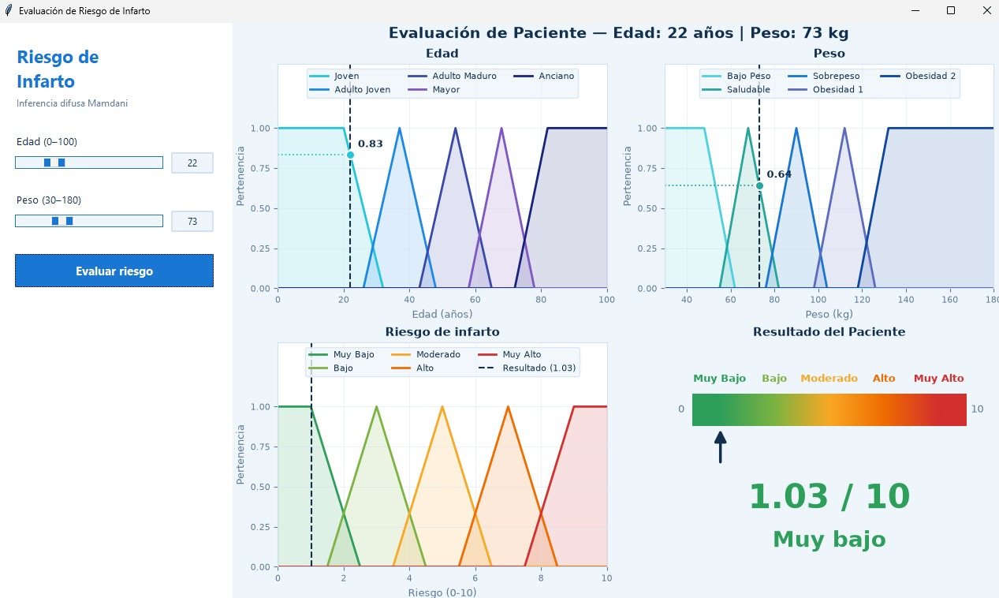
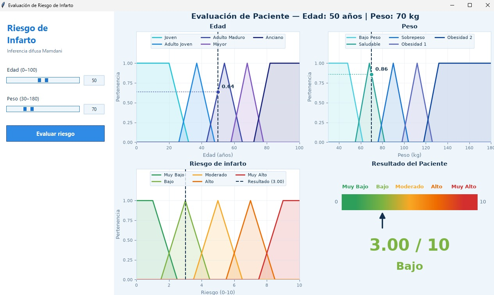
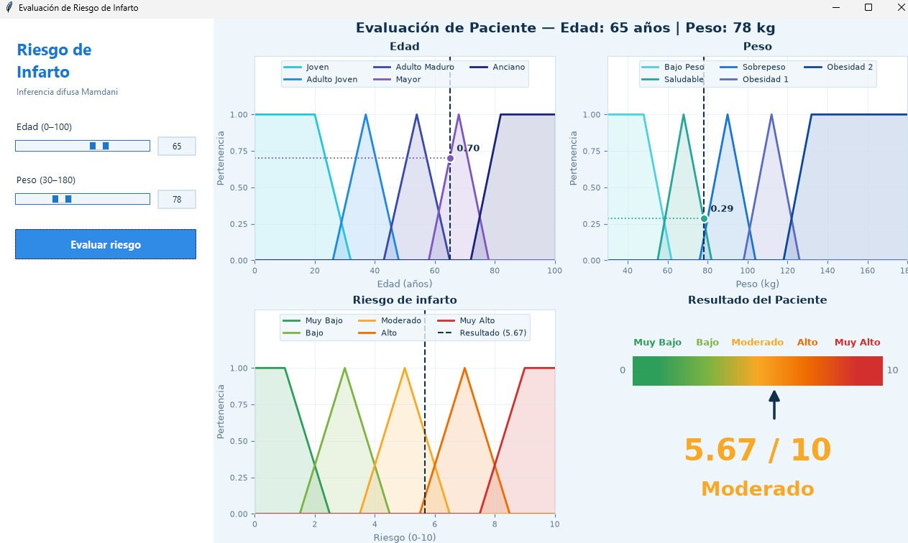
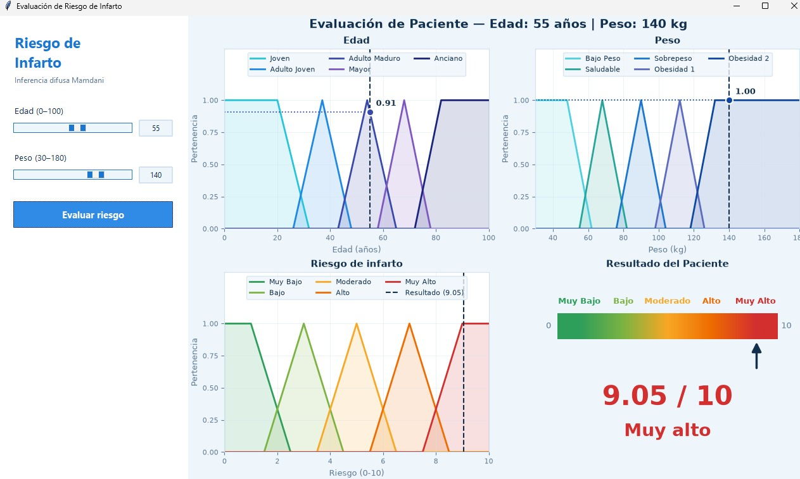

  

| | |
|---|---|
| **Asignatura** | Seminario de IA |
| **Estudiantes** | Jose Ignacio Isturiz Rabert – Juan Manuel Londoño Gonzalez |
| **Carrera** | Ingeniería Informática |
| **Fecha** | 02/10/2026 |

## 1. Introducción

Las enfermedades cardiovasculares son la principal causa de muerte en el mundo según la Organización Mundial de la Salud, y el infarto agudo de miocardio es una de sus manifestaciones más graves. Por eso, estimar a tiempo qué tan expuesta está una persona es clave para la prevención.

Las herramientas de tamizaje suelen usar umbrales rígidos: una persona con IMC de 29.9 se clasifica distinto a otra con 30.0, aunque su situación sea prácticamente la misma. La lógica difusa resuelve este problema porque permite que un valor pertenezca parcialmente a varias categorías. En este trabajo se construye un sistema de inferencia difusa que estima el riesgo de infarto en una escala de 0 a 10 a partir de la **edad** y el **peso** del paciente, y que muestra el razonamiento completo en una aplicación de escritorio.

## 2. Variables y Universos de Discurso

El sistema recibe dos entradas y produce una salida. Los rangos son amplios para abarcar desde la infancia hasta la vejez y desde el bajo peso hasta la obesidad severa:

| Variable | Rango |
|---|---|
| **Edad** | 0 – 100 años |
| **Peso** | 30 – 180 kg |
| **Riesgo de Infarto** | 0 – 10 (10 = riesgo máximo) |

## 3. Conjuntos Difusos

Cada variable se dividió en cinco conjuntos con límites apoyados en referencias clínicas. Los conjuntos de los extremos son trapezoidales, de modo que la pertenencia se mantiene en 1 a partir de cierto valor; los intermedios son triangulares y se solapan para que el paso de una categoría a otra sea gradual.

### 3.1. Edad

Los conjuntos de edad siguen el aumento del riesgo cardiovascular con los años:

| Conjunto | Parámetros | Criterio |
|---|---|---|
| **Joven** | [0, 0, 20, 32] | Riesgo cardiovascular mínimo |
| **Adulto Joven** | [26, 37, 48] | Riesgo aún reducido |
| **Adulto Maduro** | [43, 54, 65] | Inicio del aumento del riesgo coronario |
| **Mayor** | [58, 68, 78] | Riesgo elevado |
| **Anciano** | [72, 82, 100, 100] | Riesgo máximo atribuible a la edad |

### 3.2. Peso

Los límites de peso toman como referencia la clasificación del IMC de la OMS:

| Conjunto | Parámetros | Criterio |
|---|---|---|
| **Bajo Peso** | [30, 30, 48, 62] | IMC &lt; 18.5 |
| **Saludable** | [55, 68, 82] | IMC 18.5 – 24.9 (peso normal) |
| **Sobrepeso** | [76, 90, 104] | IMC 25 – 29.9 |
| **Obesidad 1** | [98, 112, 126] | IMC 30 – 34.9 |
| **Obesidad 2** | [118, 132, 180, 180] | IMC ≥ 35 |

### 3.3. Riesgo de Infarto (salida)

La escala de riesgo se reparte en cinco niveles equidistantes:

| Conjunto | Parámetros | Criterio |
|---|---|---|
| 🟢 **Muy Bajo** | [0, 0, 1, 2.5] | Centro ≈ 1 |
| 🟩 **Bajo** | [1.5, 3, 4.5] | Centro = 3 |
| 🟡 **Moderado** | [3.5, 5, 6.5] | Centro = 5 |
| 🟠 **Alto** | [5.5, 7, 8.5] | Centro = 7 |
| 🔴 **Muy Alto** | [7.5, 9, 10, 10] | Centro ≈ 9 |

## 4. Reglas de Inferencia

La base de conocimiento tiene 25 reglas, una por cada combinación de edad y peso, con la forma SI Edad ES X Y Peso ES Y ENTONCES Riesgo ES Z. El riesgo crece hacia la esquina inferior derecha de la tabla, donde coinciden la edad avanzada y la obesidad.

| Peso \ Edad | Joven | Adulto Joven | Adulto Maduro | Mayor | Anciano |
|---|:---:|:---:|:---:|:---:|:---:|
| **Bajo Peso** | 🟩 **Bajo** | 🟩 **Bajo** | 🟡 **Moderado** | 🟠 **Alto** | 🟠 **Alto** |
| **Saludable** | 🟢 **Muy Bajo** | 🟢 **Muy Bajo** | 🟩 **Bajo** | 🟡 **Moderado** | 🟡 **Moderado** |
| **Sobrepeso** | 🟩 **Bajo** | 🟡 **Moderado** | 🟠 **Alto** | 🟠 **Alto** | 🔴 **Muy Alto** |
| **Obesidad I** | 🟡 **Moderado** | 🟠 **Alto** | 🔴 **Muy Alto** | 🔴 **Muy Alto** | 🔴 **Muy Alto** |
| **Obesidad II** | 🟡 **Moderado** | 🟠 **Alto** | 🔴 **Muy Alto** | 🔴 **Muy Alto** | 🔴 **Muy Alto** |

<em>Tabla de reglas. Cada color indica el nivel de riesgo resultante.</em>

## 5. Proceso de Inferencia y Desfuzzificación

Se usa inferencia Mamdani: el operador Y de cada regla se evalúa con el mínimo, las salidas de todas las reglas se combinan con el máximo y el conjunto resultante se desfuzzifica por centroide, lo que da un puntaje de 0 a 10. El nivel que se muestra es el conjunto de salida con mayor pertenencia en ese puntaje.

## 6. Implementación

El programa es un único archivo .py organizado en tres bloques independientes:

- **Lógica difusa:** universos, conjuntos, generación automática de las 25 reglas a partir de la matriz y la función evaluar_riesgo.
- **Visualización:** figura de 2 × 2 con matplotlib: funciones de pertenencia de Edad y Peso (con el grado del conjunto dominante), salida difusa con el resultado y un panel con barra de riesgo verde → rojo.
- **Interfaz:** ventana tkinter con paleta clínica (blanco y azul), sliders sincronizados con campos numéricos, validación de rangos sin uso de consola y la gráfica incrustada que se actualiza con cada evaluación.

## 7. Pruebas y Resultados

Para comprobar el comportamiento del sistema se evaluaron cinco pacientes, elegidos para que cada uno cayera en un nivel de riesgo distinto:

| Caso | Edad | Peso | Resultado | Nivel |
|---|:---:|:---:|:---:|:---:|
| **Caso 1: riesgo muy bajo** | 22 años | 73 kg | 🟢 **1.03 / 10** | 🟢 **Muy Bajo** |
| **Caso 2: riesgo bajo** | 50 años | 70 kg | 🟩 **3.00 / 10** | 🟩 **Bajo** |
| **Caso 3: riesgo moderado** | 65 años | 78 kg | 🟡 **5.67 / 10** | 🟡 **Moderado** |
| **Caso 4: riesgo alto** | 80 años | 80 kg | 🟠 **7.39 / 10** | 🟠 **Alto** |
| **Caso 5: riesgo muy alto** | 55 años | 140 kg | 🔴 **9.05 / 10** | 🔴 **Muy Alto** |

**Caso 1: riesgo muy bajo** (Edad: 22 años, Peso: 73 kg) → 🟢 **1.03 / 10 · Muy Bajo**

Edad «Joven» (0.83) y peso «Saludable» (0.64). Solo se activa la regla Joven ∧ Saludable → Muy Bajo con fuerza 0.64. Al haber una sola regla activa, el resultado se ubica en el centro del nivel más bajo.

   
  <em>Figura 1. Interfaz con la evaluación del caso 1 (Edad 22, Peso 73 kg).</em>

**Caso 2: riesgo bajo** (Edad: 50 años, Peso: 70 kg) → 🟩 **3.00 / 10 · Bajo**

Edad «Adulto Maduro» (0.64) y peso «Saludable» (0.86). La regla Adulto Maduro ∧ Saludable → Bajo se activa con fuerza 0.64. Aunque el peso es adecuado, la edad basta para subir el resultado un nivel.

   
  <em>Figura 2. Interfaz con la evaluación del caso 2 (Edad 50, Peso 70 kg).</em>

**Caso 3: riesgo moderado** (Edad: 65 años, Peso: 78 kg) → 🟡 **5.67 / 10 · Moderado**

Edad «Mayor» (0.70) y peso en la transición Saludable (0.29) / Sobrepeso (0.14). Se activan Mayor ∧ Saludable → Moderado (0.29) y Mayor ∧ Sobrepeso → Alto (0.14); el centroide se desplaza hacia Alto.

   
  <em>Figura 3. Interfaz con la evaluación del caso 3 (Edad 65, Peso 78 kg).</em>

**Caso 4: riesgo alto** (Edad: 80 años, Peso: 80 kg) → 🟠 **7.39 / 10 · Alto**

Edad «Anciano» (0.80) y peso entre Saludable (0.14) y Sobrepeso (0.29). Se combinan Anciano ∧ Saludable → Moderado (0.14) y Anciano ∧ Sobrepeso → Muy Alto (0.29). Ninguna regla activa concluye «Alto», pero el centroide de ambas salidas cae en esa zona.

   
  <em>Figura 4. Interfaz con la evaluación del caso 4 (Edad 80, Peso 80 kg).</em>

**Caso 5: riesgo muy alto** (Edad: 55 años, Peso: 140 kg) → 🔴 **9.05 / 10 · Muy Alto**

Edad «Adulto Maduro» (0.91) y peso «Obesidad II» (1.00). La regla Adulto Maduro ∧ Obesidad II → Muy Alto se activa con fuerza 0.91: la obesidad severa lleva el riesgo al nivel máximo sin necesidad de una edad avanzada.

   
  <em>Figura 5. Interfaz con la evaluación del caso 5 (Edad 55, Peso 140 kg).</em>

## 8. Conclusiones

- Representar la edad y el peso con conjuntos difusos evita los saltos bruscos de los umbrales rígidos: cambios pequeños en los datos producen cambios proporcionales en el riesgo.
- Los trapecios de los extremos mantienen estable la salida en edades muy avanzadas y en obesidad severa, donde el riesgo ya no debería seguir creciendo.
- Las cinco pruebas recorren toda la escala de riesgo y sus resultados son coherentes con la tabla de reglas.
- La interfaz muestra cada etapa del razonamiento (pertenencias, salida difusa y puntaje), lo que facilita interpretar y justificar el resultado.
